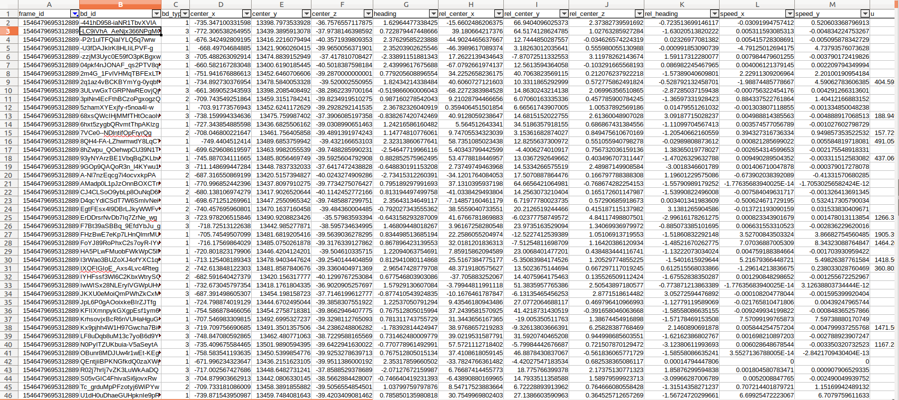
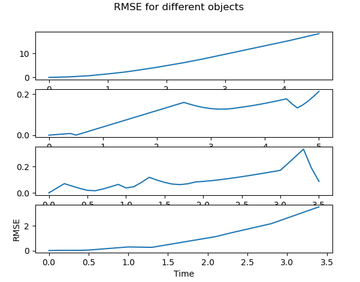
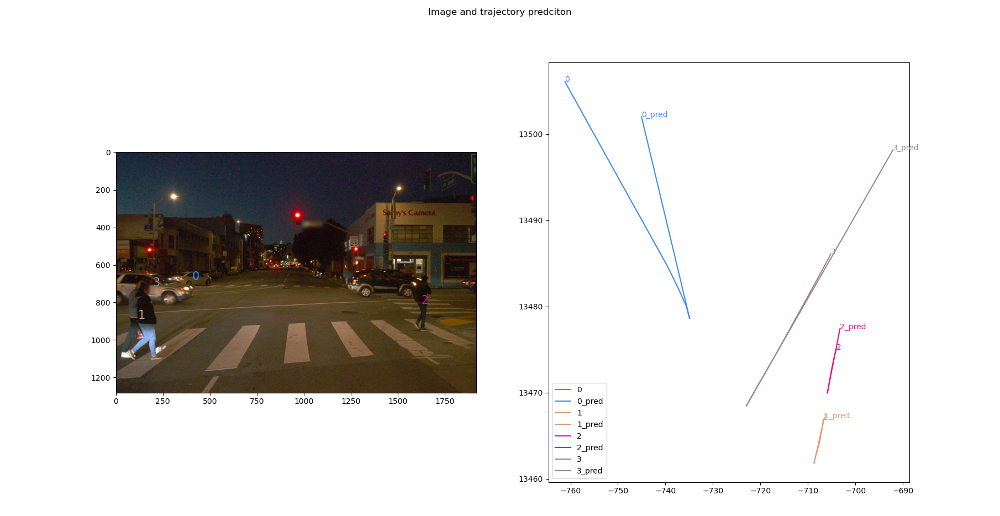

# Behavior Prediction

## Project overview

In this project, we create predicted trajectories for different objects on the road using kinematic models up to 5 seconds. All the source and ground truth data are from [Waymo Open dataset](https://waymo.com/open/). We will first extract both trajectory prediction input data and trajectory ground truth data from waymo dataset, and then create trajectires for different objects, finally we will evaluate predicted trajectories and visualize the results. 

The project resides in github, and the link is [here](https://github.com/LevinJ/behavior_prediction)


## Project dataset setup

All the project dataset work is done in `Dataloader.py` file.

### Waymo data loading

After downloading waymo, we will extract relevant information to prepare for trajectory prediction. Extracted information includes:

* ground truth 3d bounding box, which consists of frame id, object id, object type, 3D position, heading.
* front camera image
* projected 2d bouding box in front camera image

### Frame coordiante transform

At the end, we want to perform trajectory prediction and evaluation in world frame, so all 3d bounding boxes are transformed to world frame. This is done in `parse_frame` method.

TWV represents vehicle pose in world frame, and TVO represents object pose in vehicle frame, both of these are known, as a result, we can obtain objects pose in world frame as below,

```
TWO = TWV * TVO
```

Relevant coordiante frame transform codes are wrapped in `utility/poseinfo.py` file.

### Dataset for predicton

After parsing Waymo tf records and extracting relevant info as described, all the data we need in this project are stored in a csv file, something like below,


  

## Trajectories prediction

### Constant Velocity motion model
We are using a constant velocity motion model propogate object pose forward in time. The `motion_model` method in `KalmanFilter.py` file create trajectory for one single object.

Basic logic is implemented in `KalmanFilter.py` file.

The math for propogration is as shown below

```
x = [x, y, vx, vy]
F = [1,0,dt,0,
     0, 1, 0, dt,
     0, 0, 1, 0,
     0, 0, 0, 1]
x_pred = F * x
```

### Predition class

The `Predictor` class in `predictor.py` file creates trajectories for a list of objects, via calling kalman filer.


### Create predicted trajectories

The `run` method in `evaluator.py` file create trajectires for a selected list of objects, via calling the predictor.

## Evaluate results

All the evaluation codes are in `evaluator.py` file.

### RMSE

RMSE is calcuated by comparing predicted and ground truth trajectory. This is implmented in `calc_rmse` method.




### Visualizations

Below is the visualization for the expected position versus the actual position.



### Impreovement Opportunities
From the visualization charts above, we can identify several improvement opportunities.

* more complexted motion model

Object 0 is a car, and is truning left. In this case, a CTRV model might be better.

Object 3 is a car too, and the predicted trajectory is much longer than the groud truth, which indicates that the car is actually slowing down. In this case, maybe a CTRA model is better.   
* end to end deep learning prediction

Other than using motion model to predict trajectory, we can also try end to end deep learing approach to predict trajectories if we have sufficient amount of training data.


 
